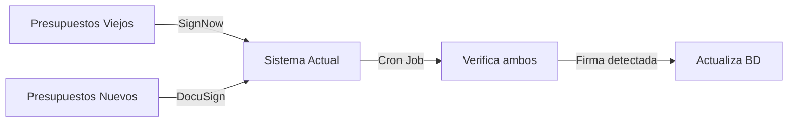

# 📝 Resumen de Integración DocuSign

## ✅ Archivos Creados

### 1. `src/services/ServiceDocuSign.js`
Servicio completo para interactuar con DocuSign API.

**Métodos principales**:
- `sendBudgetForSignature()` - Enviar documento para firma
- `isDocumentSigned()` - Verificar si está firmado
- `downloadSignedDocument()` - Descargar PDF firmado
- `getEnvelopeDetails()` - Obtener detalles del envelope
- `voidEnvelope()` - Cancelar envelope
- `resendEnvelope()` - Reenviar notificación

### 2. `migrations/add-docusign-support.js`
Migración de base de datos para soportar DocuSign.

**Cambios**:
- Agrega campo `signatureDocumentId` (genérico)
- Actualiza ENUM `signatureMethod` con valor 'docusign'
- Migra datos de `signNowDocumentId` a `signatureDocumentId`
- Mantiene compatibilidad con SignNow

### 3. `DOCUSIGN_MIGRATION_GUIDE.md`
Guía completa de migración con instrucciones paso a paso.

---

## 🔄 Archivos Modificados

### 1. `src/data/models/Budget.js`
```javascript
// ANTES
signatureMethod: ENUM('signnow', 'manual', 'legacy', 'none')

// DESPUÉS
signatureMethod: ENUM('signnow', 'docusign', 'manual', 'legacy', 'none')

// NUEVO CAMPO
signatureDocumentId: STRING  // ID genérico (SignNow o DocuSign)
```

### 2. `src/controllers/BudgetController.js`

#### Variable de control:
```javascript
const USE_DOCUSIGN = process.env.USE_DOCUSIGN === 'true';
```

#### Método `sendBudgetToSignNow()`:
- ✅ Ahora soporta **ambos servicios**
- ✅ Selecciona automáticamente según `USE_DOCUSIGN`
- ✅ Guarda `signatureMethod` correcto
- ✅ Usa `signatureDocumentId` en lugar de solo `signNowDocumentId`

#### Método `checkSignatureStatus()`:
- ✅ Detecta automáticamente el servicio según `signatureMethod`
- ✅ Verifica en SignNow o DocuSign según corresponda

#### Método `downloadSignedBudget()`:
- ✅ Descarga desde el servicio correcto automáticamente

### 3. `src/services/checkPendingSignatures.js`
- ✅ Inicializa **ambos servicios** (SignNow y DocuSign)
- ✅ Busca presupuestos con `signatureDocumentId` O `signNowDocumentId`
- ✅ Determina servicio por `signatureMethod`
- ✅ Verifica firma en el servicio correcto
- ✅ Descarga PDF desde el servicio correcto

---

## 🔑 Variables de Entorno Requeridas

Agregar al `.env`:

```env
# DocuSign Configuration
DOCUSIGN_INTEGRATION_KEY=tu_integration_key_aqui
DOCUSIGN_USER_ID=tu_user_id_guid_aqui
DOCUSIGN_ACCOUNT_ID=tu_account_id_aqui
DOCUSIGN_PRIVATE_KEY_PATH=./docusign_private.key
DOCUSIGN_ENVIRONMENT=demo  # o 'production'

# Control de migración
USE_DOCUSIGN=false  # true = DocuSign, false = SignNow
```

---

## 📦 Dependencias a Instalar

```bash
npm install docusign-esign
```

---

## 🗄️ Cambios en Base de Datos

### Tabla: `Budgets`

| Campo | Tipo | Descripción |
|-------|------|-------------|
| `signatureDocumentId` | STRING | 🆕 ID genérico (envelope o document) |
| `signatureMethod` | ENUM | 🔄 Ahora incluye 'docusign' |

---

## 🚀 Pasos para Deploy

### En Desarrollo (esta rama):

1. **Instalar dependencia**:
   ```bash
   npm install docusign-esign
   ```

2. **Obtener credenciales de DocuSign** (ver guía en `DOCUSIGN_MIGRATION_GUIDE.md`)

3. **Configurar `.env`**:
   ```env
   USE_DOCUSIGN=false  # Mantener SignNow por ahora
   DOCUSIGN_INTEGRATION_KEY=...
   DOCUSIGN_USER_ID=...
   DOCUSIGN_ACCOUNT_ID=...
   DOCUSIGN_PRIVATE_KEY_PATH=./docusign_private.key
   DOCUSIGN_ENVIRONMENT=demo
   ```

4. **Guardar llave privada**:
   - Descargarla de DocuSign
   - Guardarla en `BackZurcher/docusign_private.key`

5. **Dar consentimiento** (una sola vez):
   ```
   https://account-d.docusign.com/oauth/auth?response_type=code&scope=signature%20impersonation&client_id=TU_INTEGRATION_KEY&redirect_uri=https://www.docusign.com
   ```

6. **Ejecutar migración**:
   ```bash
   node migrations/add-docusign-support.js
   ```

7. **Probar con DocuSign**:
   ```env
   USE_DOCUSIGN=true
   ```

8. **Crear presupuesto de prueba y enviarlo a firmar**

9. **Verificar** que llegue email de DocuSign y se pueda firmar desde celular

### En Producción:

1. **Ejecutar migración**:
   ```bash
   node migrations/add-docusign-support.js
   ```

2. **Configurar `.env` de producción**:
   ```env
   USE_DOCUSIGN=false  # Por ahora mantener SignNow
   DOCUSIGN_ENVIRONMENT=production
   # ... otras credenciales de producción
   ```

3. **Probar con algunos clientes**:
   ```env
   USE_DOCUSIGN=true
   ```

4. **Monitorear ambos servicios** hasta que no haya presupuestos pendientes en SignNow

---

## 🎯 Funcionalidad Exacta como SignNow

| Funcionalidad | SignNow | DocuSign | Estado |
|--------------|---------|----------|--------|
| Enviar para firma | ✅ | ✅ | ✅ Implementado |
| Verificar estado | ✅ | ✅ | ✅ Implementado |
| Descargar firmado | ✅ | ✅ | ✅ Implementado |
| Detección automática (cron) | ✅ | ✅ | ✅ Implementado |
| Email al cliente | ✅ | ✅ | ✅ Implementado |
| Firma desde móvil | ⭐⭐⭐ | ⭐⭐⭐⭐⭐ | ✅ Mejorado |
| Múltiples firmantes | ✅ | ✅ | ✅ Soportado |

---

## 🔄 Estrategia de Migración Gradual



### Ventajas:
- ✅ Sin downtime
- ✅ Sin perder presupuestos en proceso
- ✅ Rollback inmediato (cambiar variable)
- ✅ Probar con pocos clientes primero

---

## 🧪 Testing Checklist

- [ ] Enviar presupuesto con `USE_DOCUSIGN=true`
- [ ] Verificar email de DocuSign recibido
- [ ] Firmar desde celular
- [ ] Verificar UX móvil de DocuSign
- [ ] Confirmar que cron job detecta firma
- [ ] Confirmar que PDF se descarga correctamente
- [ ] Verificar que presupuestos viejos (SignNow) siguen funcionando
- [ ] Probar `checkSignatureStatus` en ambos servicios
- [ ] Probar descarga de PDF firmado en ambos servicios

---

## 💡 Próximos Pasos

1. ✅ **Instalar dependencia** → `npm install docusign-esign`
2. ⏳ **Obtener credenciales** → Crear app en DocuSign
3. ⏳ **Configurar .env** → Agregar variables
4. ⏳ **Ejecutar migración** → `node migrations/add-docusign-support.js`
5. ⏳ **Probar** → Enviar presupuesto de prueba
6. ⏳ **Evaluar UX móvil** → Confirmar que es mejor que SignNow
7. ⏳ **Decidir migración** → Si UX es buena, cambiar a `USE_DOCUSIGN=true`

---

## 📞 Soporte

Documentación completa en: `DOCUSIGN_MIGRATION_GUIDE.md`

---

**Estado**: ✅ Listo para probar
**Compatibilidad**: ✅ 100% con sistema actual
**Risk**: 🟢 Bajo (migración gradual con rollback)
