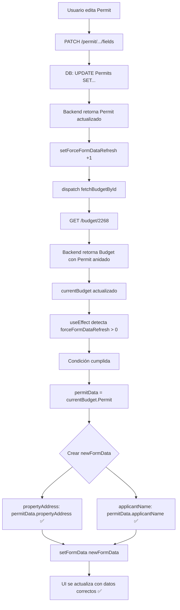

# 🐛 BUG CRÍTICO ENCONTRADO Y SOLUCIONADO

## ❌ El Problema Real

Después de implementar `forceFormDataRefresh`, el `formData` SÍ se recreaba, pero los cambios **AÚN NO SE VEÍAN** en la UI.

### Logs observados:
```bash
EditBudget.jsx:188 🔄 Recreando formData con datos actualizados del Permit: Object
✅ Permit actualizado correctamente
# Pero los cambios NO aparecen en la UI
```

---

## 🔍 Análisis Profundo

### El Bug:

En `EditBudget.jsx`, cuando se crea el `newFormData`:

```javascript
const permitData = currentBudget.Permit || {};

const newFormData = {
  permitNumber: permitData.permitNumber || "",           // ✅ Correcto (de Permit)
  propertyAddress: currentBudget.propertyAddress || "",  // ❌ MAL (de Budget, no Permit)
  applicantName: currentBudget.applicantName || "",      // ❌ MAL (de Budget, no Permit)
  applicantEmail: permitData.applicantEmail || "",       // ✅ Correcto (de Permit)
  applicantPhone: permitData.applicantPhone || "",       // ✅ Correcto (de Permit)
  lot: permitData.lot || "",                             // ✅ Correcto (de Permit)
  block: permitData.block || "",                         // ✅ Correcto (de Permit)
};
```

### ¿Por qué fallaba?

Cuando actualizas un Permit:

1. **Backend actualiza la tabla `Permits`:**
   ```sql
   UPDATE Permits SET
     permitNumber = '36-SN-278766',
     applicantName = 'Hanna Zurcher a',
     applicantPhone = '6786789990',
     propertyAddress = '7900 Blvd Lehigh Acres, FL 33974',
     lot = '34',
     block = '67'
   WHERE idPermit = '09691f3b...';
   ```

2. **Frontend recarga Budget:**
   ```javascript
   dispatch(fetchBudgetById(selectedBudgetId));
   // GET /budget/2268 200
   ```

3. **Backend devuelve Budget con Permit anidado:**
   ```json
   {
     "idBudget": 2268,
     "propertyAddress": "5500 Blvd...",  // ⚠️ Valor VIEJO en Budget
     "applicantName": "Hanna Zurcher",   // ⚠️ Valor VIEJO en Budget
     "Permit": {
       "idPermit": "09691f3b...",
       "permitNumber": "36-SN-278766",
       "applicantName": "Hanna Zurcher a",     // ✅ Valor NUEVO
       "applicantPhone": "6786789990",
       "propertyAddress": "7900 Blvd...",      // ✅ Valor NUEVO
       "lot": "34",
       "block": "67"
     }
   }
   ```

4. **formData se crea con valores INCORRECTOS:**
   ```javascript
   propertyAddress: currentBudget.propertyAddress  // "5500 Blvd..." ❌ VIEJO
   applicantName: currentBudget.applicantName      // "Hanna Zurcher" ❌ VIEJO
   
   // En lugar de:
   propertyAddress: permitData.propertyAddress     // "7900 Blvd..." ✅ NUEVO
   applicantName: permitData.applicantName         // "Hanna Zurcher a" ✅ NUEVO
   ```

5. **UI muestra valores viejos** porque `formData` tiene valores viejos

---

## ✅ La Solución

### Leer PRIMERO de `permitData`, luego de `currentBudget`:

```javascript
const permitData = currentBudget.Permit || {};

const newFormData = {
  permitNumber: permitData.permitNumber || "",
  
  // ✅ CORREGIDO: Leer de permitData PRIMERO
  propertyAddress: permitData.propertyAddress || currentBudget.propertyAddress || "",
  applicantName: permitData.applicantName || currentBudget.applicantName || "",
  
  applicantEmail: permitData.applicantEmail || "",
  applicantPhone: permitData.applicantPhone || "",
  lot: permitData.lot || "",
  block: permitData.block || "",
  // ... resto igual
};
```

### Orden de prioridad:
1. **permitData.propertyAddress** (valor actualizado del Permit) 👈 PRIMERO
2. **currentBudget.propertyAddress** (fallback si el Permit no tiene valor)

---

## 📊 Estructura de Datos

### Relación Budget ↔ Permit:

```javascript
currentBudget = {
  idBudget: 2268,
  date: "2024-11-20",
  status: "approved",
  
  // ⚠️ ESTOS CAMPOS PUEDEN ESTAR DESACTUALIZADOS
  propertyAddress: "5500 Blvd...",  // Copiado al crear Budget
  applicantName: "Hanna Zurcher",   // Copiado al crear Budget
  
  // ✅ PERMIT TIENE LOS DATOS ACTUALIZADOS
  Permit: {
    idPermit: "09691f3b...",
    permitNumber: "36-SN-278766",
    applicantName: "Hanna Zurcher a",     // ✅ ACTUALIZADO
    applicantEmail: "yanicorc@gmail.com",
    applicantPhone: "6786789990",
    propertyAddress: "7900 Blvd...",      // ✅ ACTUALIZADO
    lot: "34",
    block: "67",
    systemType: "ATU",
    // ... más campos del Permit
  },
  
  lineItems: [...],
  // ... más campos del Budget
}
```

### ¿Por qué Budget tiene campos duplicados?

Cuando se crea un Budget, algunos campos del Permit se **copian** al Budget para:
1. Facilitar búsquedas (índices en tabla Budgets)
2. Desnormalización controlada
3. Performance (evitar JOINs en queries simples)

**PERO:** Cuando actualizas el Permit, estos campos en Budget **NO se actualizan automáticamente**.

### Solución correcta:

Al construir `formData`, **siempre** leer del Permit (fuente de verdad):

```javascript
// ✅ CORRECTO: Permit es la fuente de verdad
propertyAddress: permitData.propertyAddress || currentBudget.propertyAddress
applicantName: permitData.applicantName || currentBudget.applicantName

// ❌ INCORRECTO: Budget puede tener datos viejos
propertyAddress: currentBudget.propertyAddress
applicantName: currentBudget.applicantName
```

---

## 🔄 Flujo Corregido



---

## 🧪 Testing

### Test 1: Verificar orden de lectura

**Consola del navegador:**
```javascript
// ANTES del fix:
🔄 Recreando formData con datos actualizados del Permit: {
  applicantName: "Hanna Zurcher a",      // ✅ Nuevo
  propertyAddress: "7900 Blvd..."        // ✅ Nuevo
}

// formData creado:
{
  applicantName: "Hanna Zurcher",        // ❌ Viejo (de currentBudget)
  propertyAddress: "5500 Blvd..."        // ❌ Viejo (de currentBudget)
}
```

```javascript
// DESPUÉS del fix:
🔄 Recreando formData con datos actualizados del Permit: {
  applicantName: "Hanna Zurcher a",      // ✅ Nuevo
  propertyAddress: "7900 Blvd..."        // ✅ Nuevo
}
📝 Valores clave: {
  permitNumber: "36-SN-278766",
  applicantName: "Hanna Zurcher a",
  applicantPhone: "6786789990",
  propertyAddress: "7900 Blvd Lehigh Acres, FL 33974",
  lot: "34",
  block: "67"
}

// formData creado:
{
  applicantName: "Hanna Zurcher a",      // ✅ Nuevo (de permitData)
  propertyAddress: "7900 Blvd..."        // ✅ Nuevo (de permitData)
}
```

---

### Test 2: Verificar UI

**Pasos:**
```bash
# 1. Budget #2268 tiene:
#    - Applicant Name: "Hanna Zurcher"
#    - Property Address: "5500 Blvd Lehigh Acres"
#    - Lot: "34", Block: "6"

# 2. Editar Permit:
#    - Applicant Name: "Hanna Zurcher a"
#    - Property Address: "7900 Blvd Lehigh Acres"
#    - Lot: "34", Block: "67"

# 3. Guardar

# 4. Esperar 1 segundo

# 5. VERIFICAR EN EDITBUDGET (Sección "Permit Information"):
```

**Resultado esperado:**
```
Permit Information
┌────────────────────────────────────────┐
│ Permit #: 36-SN-278766                 │
│ Property Address: 7900 Blvd Lehigh... │ ✅ NUEVO
│ Applicant Name: Hanna Zurcher a       │ ✅ NUEVO
│ Email: yanicorc@gmail.com             │
│ Phone: 6786789990                     │
│ Lot / Block: 34 / 67                  │ ✅ NUEVO (block)
└────────────────────────────────────────┘
```

---

## 📝 Logs Mejorados

Ahora verás logs detallados:

```javascript
console.log('🔄 Recreando formData con datos actualizados del Permit:', permitData);
console.log('📝 Valores clave:', {
  permitNumber: permitData.permitNumber,
  applicantName: permitData.applicantName,
  applicantPhone: permitData.applicantPhone,
  propertyAddress: permitData.propertyAddress,
  lot: permitData.lot,
  block: permitData.block
});
```

**Salida esperada:**
```bash
🔄 Recreando formData con datos actualizados del Permit: Object { ... }
📝 Valores clave: {
  permitNumber: "36-SN-278766",
  applicantName: "Hanna Zurcher a",
  applicantPhone: "6786789990",
  propertyAddress: "7900 Blvd  Lehigh Acres, FL 33974",
  lot: "34",
  block: "67"
}
```

Estos valores **deben coincidir** con lo que ves en la UI.

---

## 🎯 Resumen del Fix

### Cambio realizado:

```diff
const newFormData = {
  idBudget: currentBudget.idBudget,
  permitNumber: permitData.permitNumber || "",
- propertyAddress: currentBudget.propertyAddress || "",
+ propertyAddress: permitData.propertyAddress || currentBudget.propertyAddress || "",
- applicantName: currentBudget.applicantName || "",
+ applicantName: permitData.applicantName || currentBudget.applicantName || "",
  applicantEmail: permitData.applicantEmail || "",
  applicantPhone: permitData.applicantPhone || "",
  lot: permitData.lot || "",
  block: permitData.block || "",
```

### Resultado:

- ✅ `propertyAddress` lee de `permitData` PRIMERO
- ✅ `applicantName` lee de `permitData` PRIMERO
- ✅ Si `permitData` no tiene valor, usa `currentBudget` como fallback
- ✅ Los datos actualizados del Permit se muestran en la UI
- ✅ Sin cambios adicionales necesarios

---

## 🚨 Lección Aprendida

### Problema de Diseño:

Tener datos duplicados en múltiples tablas (`Budgets` y `Permits`) puede causar **inconsistencias**:

```
Budget:
  propertyAddress: "5500 Blvd..."  ← Valor al momento de crear Budget

Permit:
  propertyAddress: "7900 Blvd..."  ← Valor actualizado después
```

### Mejores Prácticas:

1. **Single Source of Truth:** El Permit es la fuente de verdad
2. **Leer siempre del Permit:** `permitData.field || currentBudget.field`
3. **Logs claros:** Mostrar de dónde viene cada valor
4. **Testing exhaustivo:** Verificar actualización de cada campo

### Alternativa Futura (Opcional):

Sincronizar automáticamente campos del Permit al Budget cuando se actualiza el Permit:

```javascript
// En backend, después de actualizar Permit
await Budget.update({
  propertyAddress: updatedPermit.propertyAddress,
  applicantName: updatedPermit.applicantName
}, {
  where: { PermitIdPermit: updatedPermit.idPermit }
});
```

**Ventajas:**
- Datos siempre sincronizados
- No necesitas lógica especial en frontend

**Desventajas:**
- Más complejidad en backend
- Puede haber implicaciones de negocio (¿quieres que cambiar el Permit cambie Budgets aprobados?)

---

## ✅ FIX COMPLETADO

**Archivos modificados:**
- `EditBudget.jsx`

**Cambios:**
1. ✅ `propertyAddress` lee de `permitData` primero
2. ✅ `applicantName` lee de `permitData` primero
3. ✅ Logs adicionales para debugging

**Próximo test:**
Edita un Permit y verifica que los cambios aparecen INMEDIATAMENTE en EditBudget sin recargar la página.
