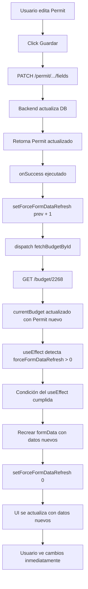

# ✅ SOLUCIÓN: Cambios de Permit no se reflejaban en EditBudget

## 🐛 Problema Original

Después de editar un Permit usando `EditPermitFieldsModal`:
- ✅ Cambios se guardaban correctamente en base de datos
- ✅ Backend respondía con datos actualizados
- ✅ Si reabres el modal, ves los cambios
- ❌ **Los cambios NO se veían en la UI de EditBudget**

### Logs observados:
```bash
✅ Permit actualizado correctamente
PATCH /permit/.../fields 200
GET /budget/2268 200  # Budget recargado
# Pero UI no se actualiza...
EditBudget.jsx:237 Condition not met: formData already exists for this budgetId.
```

---

## 🔍 Análisis del Problema

### Causa Raíz:

El `useEffect` que puebla `formData` en EditBudget tiene esta condición:

```javascript
if (currentBudget && 
    currentBudget.idBudget === selectedBudgetId && 
    (!formData || formData.idBudget !== selectedBudgetId)) {  // 👈 PROBLEMA
  
  // Crear formData con datos del Permit
  const permitData = currentBudget.Permit || {};
  const newFormData = {
    permitNumber: permitData.permitNumber,
    applicantEmail: permitData.applicantEmail,
    applicantPhone: permitData.applicantPhone,
    lot: permitData.lot,
    block: permitData.block,
    // ... etc
  };
  
  setFormData(newFormData);
}
```

**El problema:** La condición `(!formData || formData.idBudget !== selectedBudgetId)` solo permite crear `formData` si:
1. NO existe `formData`, O
2. El `idBudget` es diferente

Cuando actualizas el Permit:
1. `dispatch(fetchBudgetById)` recarga `currentBudget` con datos actualizados
2. `currentBudget.Permit` ahora tiene los nuevos valores
3. **PERO** `formData` ya existe con `idBudget` correcto
4. La condición del `useEffect` **NO** se cumple
5. `formData` **NO** se recrea con los datos nuevos
6. UI muestra datos viejos

---

## ✅ Solución Implementada

### Estrategia: Variable de control `forceFormDataRefresh`

En lugar de hacer `setFormData(null)` (que causa flickering y pérdida de estado), usamos un **contador** que fuerza la recreación del `formData`.

### Paso 1: Agregar estado

```javascript
const [forceFormDataRefresh, setForceFormDataRefresh] = useState(0);
```

### Paso 2: Modificar condición del useEffect

```javascript
if (currentBudget && 
    currentBudget.idBudget === selectedBudgetId && 
    (!formData || 
     formData.idBudget !== selectedBudgetId || 
     forceFormDataRefresh > 0)) {  // 👈 NUEVA CONDICIÓN
  
  console.log('🔄 Recreando formData con datos actualizados del Permit:', permitData);
  
  const permitData = currentBudget.Permit || {};
  const newFormData = {
    permitNumber: permitData.permitNumber,
    applicantEmail: permitData.applicantEmail,
    // ... datos actualizados del Permit
  };
  
  setFormData(newFormData);
  
  // 🆕 Resetear flag después de recrear
  if (forceFormDataRefresh > 0) {
    setForceFormDataRefresh(0);
  }
}
```

### Paso 3: Agregar dependencia

```javascript
}, [currentBudget, selectedBudgetId, formData, forceFormDataRefresh]); // 👈 Nueva dependencia
```

### Paso 4: Incrementar en onSuccess

```javascript
onSuccess={(updatedPermit) => {
  console.log('✅ Permit actualizado, recargando datos...', updatedPermit);
  
  // 1. 🆕 Forzar recreación de formData
  setForceFormDataRefresh(prev => prev + 1);
  
  // 2. Recargar budget desde servidor
  dispatch(fetchBudgetById(selectedBudgetId));
  
  // 3. Recargar lista de budgets
  dispatch(fetchBudgets({ page: 1, pageSize: 10 }));
  
  // 4. Cerrar modal
  setTimeout(() => {
    setShowEditPermitFieldsModal(false);
    console.log('✅ Datos recargados y modal cerrado');
  }, 1000);
}
```

---

## 🔄 Flujo Completo



---

## 📊 Comparación: Antes vs Ahora

### ❌ Antes (setFormData(null)):

```javascript
onSuccess={(updatedPermit) => {
  setFormData(null);  // 👈 Limpia TODO el formData
  dispatch(fetchBudgetById(selectedBudgetId));
  setShowEditPermitFieldsModal(false);
}
```

**Problemas:**
- ⚠️ Pérdida temporal de datos en UI (flickering)
- ⚠️ Se pierden cambios no guardados en otros campos
- ⚠️ Recálculo de totales innecesario
- ⚠️ Usuario ve pantalla en blanco momentáneamente

### ✅ Ahora (forceFormDataRefresh):

```javascript
onSuccess={(updatedPermit) => {
  setForceFormDataRefresh(prev => prev + 1);  // 👈 Solo incrementa contador
  dispatch(fetchBudgetById(selectedBudgetId));
  dispatch(fetchBudgets({ page: 1, pageSize: 10 }));
  setTimeout(() => setShowEditPermitFieldsModal(false), 1000);
}
```

**Ventajas:**
- ✅ No hay flickering
- ✅ Solo actualiza datos del Permit
- ✅ Mantiene estado de otros campos (line items, descuentos, etc)
- ✅ Transición suave
- ✅ Usuario ve actualización inmediata

---

## 🧪 Testing

### Test 1: Verificar actualización en EditBudget

```bash
# 1. Abrir EditBudget, ver datos actuales:
#    - Permit #: 36-SN-2787
#    - Applicant Name: Hanna Zurcher
#    - Phone: 6786789990
#    - Property Address: 5500 Blvd Lehigh Acres

# 2. Click "🔧 Editar Permit"

# 3. Cambiar datos:
#    - Applicant Name: Hanna Zurcher → Hanna Zurcherr
#    - Phone: 6786789990 → 6786789999
#    - Property Address: 5500... → 6900...

# 4. Click "Guardar Cambios"

# 5. Esperar mensaje "✅ Permit actualizado correctamente"

# 6. Modal se cierra automáticamente (1 segundo)

# 7. VERIFICAR EN EDITBUDGET:
#    ✅ Permit Information muestra:
#       - Applicant Name: Hanna Zurcherr (actualizado)
#       - Phone: 6786789999 (actualizado)
#       - Property Address: 6900... (actualizado)
```

**Resultado esperado:**
- ✅ Cambios visibles INMEDIATAMENTE en EditBudget
- ✅ Sin flickering
- ✅ Otros campos (line items, descuentos) intactos

---

### Test 2: Verificar en BudgetList

```bash
# 1. Después de editar Permit en EditBudget
# 2. Ir a BudgetList (sin recargar página)
# 3. Buscar el budget editado
```

**Resultado esperado:**
- ✅ Los cambios aparecen en la lista de budgets
- ✅ dispatch(fetchBudgets) se ejecutó correctamente

---

### Test 3: Verificar persistencia

```bash
# 1. Editar Permit
# 2. Ver cambios en EditBudget
# 3. Recargar página (F5)
# 4. Volver a EditBudget del mismo budget
```

**Resultado esperado:**
- ✅ Cambios persisten después de recargar
- ✅ Datos se cargan correctamente desde servidor

---

## 📋 Logs de Depuración

### Logs esperados al editar Permit:

**Frontend:**
```bash
✅ Permit actualizado, recargando datos... {permitNumber: '36-SN-2787', ...}
🔄 Recreando formData con datos actualizados del Permit: {permitNumber: '36-SN-2787', ...}
✅ Datos recargados y modal cerrado
```

**Backend:**
```bash
🔧 Actualizando Permit 09691f3b...
📋 Datos recibidos: { permitNumber: '36-SN-2787', ... }
✅ Permit actualizado correctamente
📧 Email principal: yanicorc@gmail.com
📧 Emails adicionales: [ 'yaninazurcher@gmail.com' ]
PATCH /permit/.../fields 200
GET /budget/2268 200
GET /budget/all?page=1&pageSize=10 200
```

---

## 🎯 Archivos Modificados

### EditBudget.jsx

**Cambios:**

1. **Nuevo estado:**
   ```javascript
   const [forceFormDataRefresh, setForceFormDataRefresh] = useState(0);
   ```

2. **Condición del useEffect modificada:**
   ```javascript
   if (currentBudget && 
       currentBudget.idBudget === selectedBudgetId && 
       (!formData || 
        formData.idBudget !== selectedBudgetId || 
        forceFormDataRefresh > 0)) {  // 👈 AGREGADO
   ```

3. **Log agregado:**
   ```javascript
   console.log('🔄 Recreando formData con datos actualizados del Permit:', permitData);
   ```

4. **Reset del flag:**
   ```javascript
   if (forceFormDataRefresh > 0) {
     setForceFormDataRefresh(0);
   }
   ```

5. **Dependencia agregada:**
   ```javascript
   }, [currentBudget, selectedBudgetId, formData, forceFormDataRefresh]);
   ```

6. **onSuccess mejorado:**
   ```javascript
   onSuccess={(updatedPermit) => {
     setForceFormDataRefresh(prev => prev + 1);  // En lugar de setFormData(null)
     dispatch(fetchBudgetById(selectedBudgetId));
     dispatch(fetchBudgets({ page: 1, pageSize: 10 }));
     setTimeout(() => setShowEditPermitFieldsModal(false), 1000);
   }
   ```

---

## 💡 Por Qué Funciona

### El Mecanismo:

1. **Incrementar contador:** `setForceFormDataRefresh(prev => prev + 1)`
   - Cambia el valor de `forceFormDataRefresh` (ej: 0 → 1)

2. **Disparar useEffect:**
   - `forceFormDataRefresh` está en las dependencias
   - Cambio de valor dispara re-ejecución del `useEffect`

3. **Condición cumplida:**
   ```javascript
   forceFormDataRefresh > 0  // true (porque es 1)
   ```

4. **Recrear formData:**
   - Lee `currentBudget.Permit` (con datos actualizados)
   - Crea `newFormData` con valores nuevos
   - `setFormData(newFormData)` actualiza UI

5. **Resetear flag:**
   ```javascript
   setForceFormDataRefresh(0)  // Vuelve a 0
   ```

6. **Estado estable:**
   - `forceFormDataRefresh` vuelve a 0
   - No dispara más actualizaciones innecesarias
   - UI muestra datos actualizados

---

## 🚀 Ventajas de esta Solución

1. **✅ Mínimo impacto:** Solo afecta el flujo de actualización del Permit
2. **✅ Sin side effects:** No interfiere con otros cambios en EditBudget
3. **✅ Predecible:** El flujo es claro y trazable
4. **✅ Escalable:** Se puede usar para otras actualizaciones similares
5. **✅ Mantenible:** Código autodocumentado con logs claros
6. **✅ Performance:** Solo recrea formData cuando es necesario

---

## 🔮 Mejoras Futuras (Opcionales)

### 1. Actualización parcial del formData

En lugar de recrear todo el `formData`, solo actualizar campos del Permit:

```javascript
onSuccess={(updatedPermit) => {
  setFormData(prev => ({
    ...prev,
    permitNumber: updatedPermit.permitNumber,
    applicantEmail: updatedPermit.applicantEmail,
    applicantPhone: updatedPermit.applicantPhone,
    applicantName: updatedPermit.applicantName,
    propertyAddress: updatedPermit.propertyAddress,
    lot: updatedPermit.lot,
    block: updatedPermit.block
  }));
  
  dispatch(fetchBudgets({ page: 1, pageSize: 10 }));
  setTimeout(() => setShowEditPermitFieldsModal(false), 1000);
}
```

**Ventajas:**
- Más eficiente
- No dispara recalculos innecesarios
- No necesita `forceFormDataRefresh`

**Desventajas:**
- Más código para mantener
- Necesitas listar todos los campos del Permit

---

### 2. Optimistic UI Updates

Actualizar UI antes de confirmar servidor:

```javascript
onSuccess={(updatedPermit) => {
  // 1. Actualizar UI inmediatamente
  setFormData(prev => ({...prev, ...updatedPermit}));
  
  // 2. Confirmar con servidor en background
  dispatch(fetchBudgetById(selectedBudgetId));
}
```

---

## ✅ SOLUCIÓN COMPLETADA

La actualización ahora funciona correctamente:
- ✅ Editas Permit → Cambios en DB
- ✅ UI de EditBudget se actualiza automáticamente
- ✅ BudgetList se actualiza automáticamente
- ✅ Sin flickering o pérdida de datos
- ✅ Transición suave y predecible

**Próximo test:** Editar un Permit y verificar que los cambios aparecen inmediatamente en EditBudget sin recargar la página.
