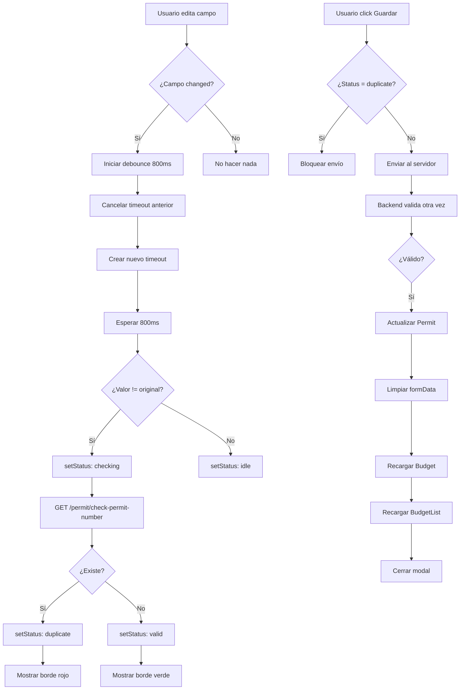

# ✅ VALIDACIÓN EN TIEMPO REAL - Edit Permit Fields

## 🎯 Implementación Completada

### Funcionalidades Agregadas:

#### 1. **Validación en Tiempo Real de Permit Number**
- ✅ Verifica duplicados mientras el usuario escribe (con debounce de 800ms)
- ✅ Valida también al perder el foco (onBlur)
- ✅ Compara con el valor original (no valida si no cambió)
- ✅ Indicador visual (rojo/verde/azul según estado)
- ✅ Mensaje debajo del input

#### 2. **Validación en Tiempo Real de Property Address**
- ✅ Verifica duplicados mientras el usuario escribe (con debounce de 800ms)
- ✅ Valida también al perder el foco (onBlur)
- ✅ Compara con el valor original
- ✅ Indicador visual con colores
- ✅ Mensaje de validación

#### 3. **Recarga de Lista de Budgets**
- ✅ Después de editar un Permit, recarga la lista de budgets
- ✅ Los cambios se reflejan en BudgetList inmediatamente

---

## 📋 Estados de Validación

### Estados del `permitNumberValidation` y `propertyAddressValidation`:

```javascript
{
  status: 'idle' | 'checking' | 'valid' | 'duplicate' | 'error',
  message: string
}
```

#### Estados:

1. **`idle`** - Sin validar (campo vacío o igual al original)
   - Sin color especial
   - Sin mensaje

2. **`checking`** - Validando en servidor
   - Borde azul, fondo azul claro
   - Mensaje: "🔍 Verificando..."

3. **`valid`** - Valor disponible
   - Borde verde, fondo verde claro
   - Mensaje: "✅ Número disponible" / "✅ Dirección disponible"

4. **`duplicate`** - Valor ya existe
   - Borde rojo, fondo rojo claro
   - Mensaje: "❌ Este número ya existe" / "❌ Esta dirección ya existe"
   - **BLOQUEA EL ENVÍO**

5. **`error`** - Error al validar
   - Borde gris
   - Mensaje: "⚠️ Error al verificar"

---

## 🔧 Cómo Funciona

### 1. **Al cargar el modal:**
```javascript
// Guardar valores originales
setOriginalPermitNumber(permit.permitNumber || '');
setOriginalPropertyAddress(permit.propertyAddress || '');
```

### 2. **Al escribir (onChange):**
```javascript
// Debounce de 800ms
if (name === 'permitNumber') {
  if (permitNumberCheckTimeout) clearTimeout(permitNumberCheckTimeout);
  
  const timeoutId = setTimeout(() => {
    validatePermitNumber(value);
  }, 800);
  
  setPermitNumberCheckTimeout(timeoutId);
}
```

### 3. **Al perder el foco (onBlur):**
```javascript
onBlur={() => {
  if (formData.permitNumber && formData.permitNumber.trim() !== originalPermitNumber) {
    validatePermitNumber(formData.permitNumber);
  }
}}
```

### 4. **Validación en servidor:**

**Para Permit Number:**
```javascript
const validatePermitNumber = async (permitNumber) => {
  // Si es igual al original, no validar
  if (permitNumber.trim() === originalPermitNumber) {
    setPermitNumberValidation({ status: 'idle', message: '' });
    return;
  }

  setPermitNumberValidation({ status: 'checking', message: '🔍 Verificando...' });

  try {
    const response = await axios.get(
      `${API_URL}/permit/check-permit-number/${encodeURIComponent(permitNumber.trim())}`,
      { headers: { Authorization: `Bearer ${token}` } }
    );

    if (response.data.exists) {
      setPermitNumberValidation({ 
        status: 'duplicate', 
        message: `❌ Este número ya existe` 
      });
    } else {
      setPermitNumberValidation({ 
        status: 'valid', 
        message: '✅ Número disponible' 
      });
    }
  } catch (err) {
    setPermitNumberValidation({ 
      status: 'error', 
      message: '⚠️ Error al verificar' 
    });
  }
};
```

**Para Property Address:**
```javascript
const validatePropertyAddress = async (propertyAddress) => {
  // Si es igual al original, no validar
  if (propertyAddress.trim() === originalPropertyAddress) {
    setPropertyAddressValidation({ status: 'idle', message: '' });
    return;
  }

  setPropertyAddressValidation({ status: 'checking', message: '🔍 Verificando...' });

  try {
    const response = await axios.get(
      `${API_URL}/permit/check-by-address?propertyAddress=${encodeURIComponent(propertyAddress.trim())}`,
      { headers: { Authorization: `Bearer ${token}` } }
    );

    if (response.data.exists) {
      setPropertyAddressValidation({ 
        status: 'duplicate', 
        message: `❌ Esta dirección ya existe` 
      });
    } else {
      setPropertyAddressValidation({ 
        status: 'valid', 
        message: '✅ Dirección disponible' 
      });
    }
  } catch (err) {
    // 404 = no existe (disponible)
    if (err.response?.status === 404) {
      setPropertyAddressValidation({ 
        status: 'valid', 
        message: '✅ Dirección disponible' 
      });
    } else {
      setPropertyAddressValidation({ 
        status: 'error', 
        message: '⚠️ Error al verificar' 
      });
    }
  }
};
```

### 5. **Validación antes de enviar:**
```javascript
const handleSubmit = async (e) => {
  e.preventDefault();
  
  // Bloquear si hay duplicados
  if (permitNumberValidation.status === 'duplicate') {
    setError('❌ No se puede usar un número de permit duplicado');
    setLoading(false);
    return;
  }

  if (propertyAddressValidation.status === 'duplicate') {
    setError('❌ No se puede usar una dirección duplicada');
    setLoading(false);
    return;
  }

  // Continuar con el envío...
};
```

---

## 🎨 Estilos Visuales

### Clases CSS según estado:

```javascript
className={`w-full px-3 py-2 border rounded-md focus:outline-none focus:ring-2 ${
  validation.status === 'duplicate'
    ? 'border-red-500 bg-red-50 focus:ring-red-500'
    : validation.status === 'valid'
    ? 'border-green-500 bg-green-50 focus:ring-green-500'
    : validation.status === 'checking'
    ? 'border-blue-500 bg-blue-50 focus:ring-blue-500'
    : 'border-gray-300 focus:ring-blue-500'
}`}
```

### Colores de mensajes:

```javascript
className={`mt-1 text-xs ${
  validation.status === 'duplicate'
    ? 'text-red-600'
    : validation.status === 'valid'
    ? 'text-green-600'
    : validation.status === 'checking'
    ? 'text-blue-600'
    : 'text-gray-600'
}`}
```

---

## 🔄 Flujo de Actualización Completo



---

## 🧪 Testing

### Test 1: Validación de Permit Number

```bash
# 1. Abrir EditBudget, click "🔧 Editar Permit"
# 2. Cambiar Permit Number a uno existente (ej: "36-SN-111111")
# 3. Esperar 800ms
# 4. Observar:
#    - Input se vuelve rojo
#    - Mensaje: "❌ Este número ya existe"
# 5. Intentar guardar
# 6. Ver error: "❌ No se puede usar un número de permit duplicado"
```

**Resultado esperado:**
- ✅ Validación en tiempo real funciona
- ✅ No permite guardar duplicados

---

### Test 2: Validación de Property Address

```bash
# 1. Abrir EditBudget, click "🔧 Editar Permit"
# 2. Cambiar Property Address a una existente
# 3. Esperar 800ms
# 4. Observar:
#    - Input se vuelve rojo
#    - Mensaje: "❌ Esta dirección ya existe"
# 5. Intentar guardar
# 6. Ver error: "❌ No se puede usar una dirección duplicada"
```

**Resultado esperado:**
- ✅ Validación en tiempo real funciona
- ✅ No permite guardar duplicados

---

### Test 3: No validar valor original

```bash
# 1. Abrir EditBudget, click "🔧 Editar Permit"
# 2. Ver Permit Number actual (ej: "36-SN-123456")
# 3. Cambiar a otro valor
# 4. Volver a escribir "36-SN-123456" (original)
# 5. Observar:
#    - Input normal (sin color)
#    - Sin mensaje de validación
```

**Resultado esperado:**
- ✅ No valida si el valor es igual al original
- ✅ Ahorra peticiones innecesarias

---

### Test 4: Recarga de BudgetList

```bash
# 1. Abrir BudgetList, ver datos de un budget
# 2. Abrir EditBudget de ese budget
# 3. Click "🔧 Editar Permit"
# 4. Cambiar Applicant Name (ej: "Juan" → "Juan Pérez")
# 5. Guardar cambios
# 6. Esperar mensaje "✅ Permit actualizado correctamente"
# 7. Modal se cierra automáticamente
# 8. Volver a BudgetList
```

**Resultado esperado:**
- ✅ Los cambios aparecen en BudgetList SIN recargar página
- ✅ dispatch(fetchBudgets) se ejecutó automáticamente

---

## 📊 Logs de Depuración

Cuando editas un Permit, verás:

**Frontend:**
```bash
✅ Permit actualizado, recargando datos...
✅ Datos recargados y modal cerrado
```

**Backend:**
```bash
🔧 Actualizando Permit 09691f3b...
📋 Datos recibidos: { permitNumber: '36-SN-2787786', ... }
✅ Permit actualizado correctamente
📧 Email principal: yanicorc@gmail.com
📧 Emails adicionales: [ 'yaninazurcher@gmail.com' ]
PATCH /permit/09691f3b.../fields 200 651.663 ms
```

---

## ✅ Comparación con PdfReceipt

| Característica | PdfReceipt | EditPermitFieldsModal |
|---------------|------------|----------------------|
| Validación de Permit Number | ✅ | ✅ |
| Validación de Property Address | ✅ | ✅ |
| Debounce (800ms) | ✅ | ✅ |
| Validación onBlur | ✅ | ✅ |
| Comparar con original | ✅ | ✅ |
| Estados visuales | ✅ | ✅ |
| Bloqueo de envío | ✅ | ✅ |
| Recarga de lista | ❌ | ✅ |

---

## 🎯 Archivos Modificados

### Frontend:

1. **`EditPermitFieldsModal.jsx`** (COMPLETO)
   - ✅ Estados de validación agregados
   - ✅ Funciones `validatePermitNumber()` y `validatePropertyAddress()`
   - ✅ Validación en `handleInputChange` con debounce
   - ✅ Validación en `onBlur`
   - ✅ Bloqueo en `handleSubmit`
   - ✅ Estilos condicionales en inputs
   - ✅ Mensajes de validación

2. **`EditBudget.jsx`** (MEJORADO)
   - ✅ `onSuccess` recarga `fetchBudgetById`
   - ✅ `onSuccess` recarga `fetchBudgets` (BudgetList)
   - ✅ Delay de 1 segundo antes de cerrar modal

---

## 🚀 Próximos Pasos (Opcionales)

### 1. Toast Notifications
```javascript
import { toast } from 'react-toastify';

// En validatePermitNumber
if (response.data.exists) {
  toast.warn('Este número de permit ya existe');
}
```

### 2. Validación de otros campos
- `applicantEmail` - Verificar formato
- `expirationDate` - Validar que no esté vencida
- `lot` / `block` - Validar formato numérico

### 3. Historial de cambios
- Registrar quién editó el Permit
- Mostrar log de cambios

---

**✅ VALIDACIÓN EN TIEMPO REAL COMPLETADA**

Ahora el modal de Edit Permit Fields tiene la misma validación robusta que PdfReceipt, y además recarga automáticamente la lista de budgets para que los cambios se vean en todas las vistas.
