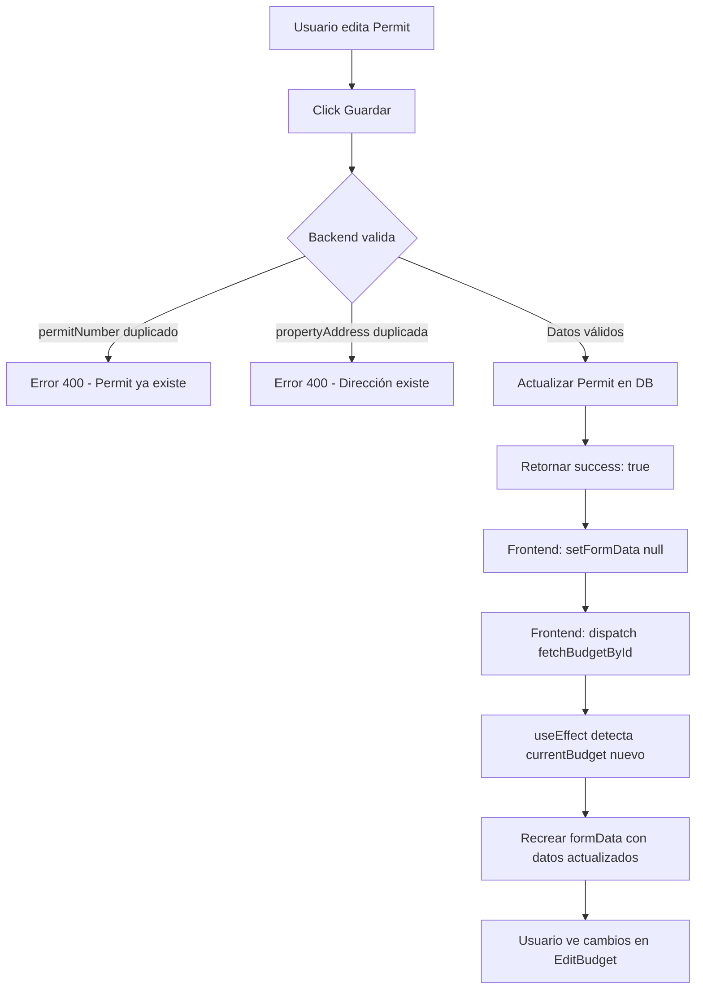

# ✅ VALIDACIONES Y MEJORAS - Edición de Permits

## 🎯 Problemas Resueltos

### 1. ❌ **Cambios no se reflejaban en EditBudget**
**Causa:** El `formData` no se recargaba después de actualizar el Permit

**Solución:**
```javascript
// En EditBudget.jsx - onSuccess del modal
onSuccess={(updatedPermit) => {
  // 1. Limpiar formData para forzar recreación
  setFormData(null);
  
  // 2. Recargar budget desde servidor
  dispatch(fetchBudgetById(selectedBudgetId)).then(() => {
    // 3. El useEffect recreará formData con datos actualizados
    setTimeout(() => {
      setShowEditPermitFieldsModal(false);
    }, 500);
  });
}
```

**Resultado:** ✅ Los cambios ahora se ven inmediatamente en EditBudget

---

### 2. ❌ **Faltaban validaciones de duplicados**

#### A. Validación de `permitNumber` duplicado

**Backend - PermitController.js:**
```javascript
// Validar permitNumber único si se está cambiando
if (permitNumber && permitNumber.trim() !== permit.permitNumber) {
  const { Op } = require('sequelize');
  const existingPermit = await Permit.findOne({
    where: { 
      permitNumber: permitNumber.trim(),
      idPermit: { [Op.ne]: idPermit } // Excluir el actual
    }
  });

  if (existingPermit) {
    return res.status(400).json({
      error: true,
      message: `El número de permit '${permitNumber}' ya está en uso`,
      field: 'permitNumber'
    });
  }
}
```

**Resultado:** ✅ No se pueden duplicar números de permit

---

#### B. Validación de `propertyAddress` duplicada

**Backend - PermitController.js:**
```javascript
// Validar propertyAddress única si se está cambiando
if (propertyAddress && propertyAddress.trim() !== permit.propertyAddress) {
  const { Op } = require('sequelize');
  const existingPermitByAddress = await Permit.findOne({
    where: { 
      propertyAddress: propertyAddress.trim(),
      idPermit: { [Op.ne]: idPermit } // Excluir el actual
    }
  });

  if (existingPermitByAddress) {
    return res.status(400).json({
      error: true,
      message: `La dirección '${propertyAddress}' ya existe en otro permit`,
      field: 'propertyAddress'
    });
  }
}
```

**Resultado:** ✅ No se pueden duplicar direcciones de propiedad

---

### 3. ✅ **Mejoras en manejo de errores**

**Frontend - EditPermitFieldsModal.jsx:**
```javascript
catch (err) {
  console.error('Error updating permit:', err);
  
  // Mostrar mensaje específico según el campo
  const errorMsg = err.response?.data?.message || 'Error al actualizar Permit';
  const errorField = err.response?.data?.field;
  
  if (errorField === 'permitNumber') {
    setError('❌ ' + errorMsg + ' - Por favor use otro número de permit.');
  } else if (errorField === 'propertyAddress') {
    setError('❌ ' + errorMsg + ' - Esta dirección ya existe en otro permit.');
  } else {
    setError('❌ ' + errorMsg);
  }
}
```

**Resultado:** ✅ Mensajes de error claros y específicos

---

## 📋 Campos Validados

### Validaciones en Backend:

1. **permitNumber**
   - ✅ Requerido
   - ✅ Único (no puede duplicarse)
   - ✅ Se excluye el permit actual al validar

2. **propertyAddress**
   - ✅ Único (no puede duplicarse)
   - ✅ Se excluye el permit actual al validar

3. **applicantEmail**
   - ✅ Formato de email (validado por Sequelize)

4. **notificationEmails**
   - ✅ Array de emails
   - ✅ Procesa string, JSON o array
   - ✅ Formato de cada email validado

---

## 🧪 Testing

### Test 1: Editar Permit y ver cambios
```bash
# 1. Abrir EditBudget
# 2. Click en "🔧 Editar Permit"
# 3. Cambiar campos (ej: lot, block, email)
# 4. Click "Guardar Cambios"
# 5. Esperar mensaje "✅ Permit actualizado correctamente"
# 6. Modal se cierra automáticamente
# 7. Verificar que los cambios aparecen en la sección "Client Information"
```

**Resultado esperado:** ✅ Los cambios se ven inmediatamente

---

### Test 2: Intentar duplicar Permit Number
```bash
# 1. Tomar nota del Permit Number de otro permit (ej: "36-SN-111111")
# 2. Abrir EditBudget de un presupuesto diferente
# 3. Click en "🔧 Editar Permit"
# 4. Cambiar Permit Number al número anotado
# 5. Click "Guardar Cambios"
```

**Resultado esperado:** 
```
❌ El número de permit '36-SN-111111' ya está en uso - Por favor use otro número de permit.
```

---

### Test 3: Intentar duplicar Property Address
```bash
# 1. Tomar nota de una Property Address existente
# 2. Abrir EditBudget de un presupuesto diferente
# 3. Click en "🔧 Editar Permit"
# 4. Cambiar Property Address a la dirección anotada
# 5. Click "Guardar Cambios"
```

**Resultado esperado:**
```
❌ La dirección 'xxxx' ya existe en otro permit - Esta dirección ya existe en otro permit.
```

---

### Test 4: Emails adicionales
```bash
# 1. Abrir EditBudget
# 2. Click en "🔧 Editar Permit"
# 3. Agregar email en "Emails Adicionales"
# 4. Click "Agregar"
# 5. Repetir para varios emails
# 6. Remover uno con el botón "×"
# 7. Click "Guardar Cambios"
```

**Resultado esperado:** 
- ✅ Emails se agregan como tags
- ✅ Se pueden remover
- ✅ Se guardan correctamente
- ✅ Aparecen en consola: `📧 Emails adicionales: [ 'email1@test.com', 'email2@test.com' ]`

---

## 📊 Logs del Backend

Cuando actualizas un Permit, verás:
```bash
🔧 Actualizando Permit 09691f3b-15b7-4745-8e14-05d16740d878...
📋 Datos recibidos: {
  permitNumber: '36-SN-2787788',
  lot: '34',
  block: '6',
  systemType: 'ATU',
  isPBTS: true,
  ...
  notificationEmails: [ 'yaninazurcher@gmail.com' ]
}
✅ Permit 09691f3b-15b7-4745-8e14-05d16740d878 actualizado correctamente
📧 Email principal: yanicorc@gmail.com
📧 Emails adicionales: [ 'yaninazurcher@gmail.com' ]
PATCH /permit/09691f3b.../fields 200 677.689 ms - 446054
```

---

## 🔄 Flujo Completo



---

## 🎯 Archivos Modificados

### Backend:
1. **`BackZurcher/src/controllers/PermitController.js`**
   - ✅ Agregada validación de `permitNumber` único
   - ✅ Agregada validación de `propertyAddress` única
   - ✅ Logs mejorados con emojis

### Frontend:
1. **`FrontZurcher/src/Components/Budget/EditPermitFieldsModal.jsx`**
   - ✅ Mejora en manejo de errores con mensajes específicos
   - ✅ Emojis en mensajes de éxito/error
   - ✅ No cierra modal inmediatamente (espera 1 segundo)

2. **`FrontZurcher/src/Components/Budget/EditBudget.jsx`**
   - ✅ `onSuccess` limpia `formData` antes de recargar
   - ✅ Espera 500ms antes de cerrar modal
   - ✅ Logs de depuración mejorados

---

## ✅ Checklist de Implementación

- [x] Validación de `permitNumber` duplicado
- [x] Validación de `propertyAddress` duplicada
- [x] Mensajes de error específicos
- [x] Recarga de datos después de guardar
- [x] Limpieza de `formData` para forzar recreación
- [x] Logs de depuración en backend
- [x] Logs de depuración en frontend
- [x] Manejo de emails adicionales

---

## 🚀 Próximos Pasos

### Opcional - Validación en Tiempo Real:
```javascript
// En EditPermitFieldsModal.jsx - agregar validación mientras se escribe

const [permitNumberError, setPermitNumberError] = useState('');

const checkPermitNumberAvailability = async (permitNumber) => {
  if (!permitNumber || permitNumber.trim() === '') return;
  
  try {
    const response = await axios.get(
      `${API_URL}/permit/check-permit-number/${permitNumber}`,
      { headers: { Authorization: `Bearer ${token}` } }
    );
    
    if (response.data.exists) {
      setPermitNumberError('⚠️ Este número de permit ya existe');
    } else {
      setPermitNumberError('');
    }
  } catch (err) {
    console.error('Error checking permit number:', err);
  }
};

// En el input de permitNumber
<input
  onChange={(e) => {
    handleInputChange(e);
    // Validar después de 500ms de que el usuario deje de escribir
    clearTimeout(permitNumberTimeout);
    permitNumberTimeout = setTimeout(() => {
      checkPermitNumberAvailability(e.target.value);
    }, 500);
  }}
/>
```

---

**✅ IMPLEMENTACIÓN COMPLETA Y LISTA PARA USAR**
